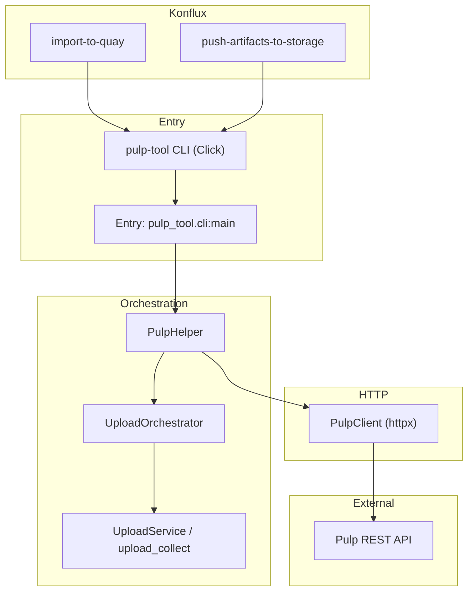

# Architecture (pulp-tool)

Living overview of **system design, boundaries, and constraints**.

Complements [README.md](../README.md) (users), [AGENTS.md](../AGENTS.md) (agents: start with **Bootstrap**), and [CLAUDE.md](../CLAUDE.md) (Tekton flags and paths). Detailed CLI flags: [cli-reference.md](cli-reference.md).

Template inspiration: [architecture.md](https://architecture.md/) · examples: [awesome-architecture-md](https://github.com/noahbald/awesome-architecture-md).

---

## 1. Repository overview

**pulp-tool** is a Python **library and Click CLI** that talks to a **[Pulp](https://pulpproject.org/)** instance over HTTP (RPM/file content, repositories, uploads, pulls). It is used **interactively** and **inside Konflux** (Tekton) steps to push build artifacts and write metadata consumed by downstream automation.

**Where it fits:** Artifact storage and CI integration for builds that land in Pulp-backed distributions—not a Brew/dist-git/Errata Tool component. Those systems are outside this repo; this client assumes a reachable Pulp API and (in Konflux) Tekton-staged workspaces.

---

## 2. High-level diagram

**Upload data path:** CLI → `PulpHelper.setup_repositories` / `process_uploads` → `UploadOrchestrator` + `upload_service` / `upload_collect` → `PulpClient` → Pulp.

**Konflux:** Tasks invoke the same CLI with mounted config and `/var/workdir/results`; see [CLAUDE.md](../CLAUDE.md) for exact flags and guardrails.

---

## 3. Core components (code map)

| Layer | Path | Role |
|-------|------|------|
| CLI | `pulp_tool/cli/` | `upload`, `upload_files`, `pull`, `search_by`, `create_repository`; shared globals (`--config`, `--build-id`, `--namespace`) |
| HTTP client | `pulp_tool/api/pulp_client/` | Session, chunked GET, RPM/content queries, repository ops |
| Other API surface | `pulp_tool/api/` (`artifacts/`, `content/`, `distributions/`, `repositories/`, `tasks/`) | Typed calls aligned with Pulp endpoints |
| Orchestration | `pulp_tool/utils/pulp_helper.py`, `upload_orchestrator.py` | Repo setup, upload pipelines |
| Services | `pulp_tool/services/upload_service.py`, `upload_collect.py` | Same flows as CLI; Konflux results JSON, SBOM, artifact results |
| Pull | `pulp_tool/pull/` | Download / transfer helpers |
| Models | `pulp_tool/models/` | Pydantic: context, Pulp DTOs, results |
| Utils | `pulp_tool/utils/` | Validation, logging, RPM helpers, session retries |
| Container | `.tekton/pulp-tool-container-build-push.yaml` | Image published for Tekton `pulp-tool-container` |
| Tests | `tests/` (see [tests/README.md](../tests/README.md)), `tests/support/` | Fixtures, TLS helpers |

**Invariant:** `UploadService` delegates to **`PulpHelper`**; do not maintain a second upload implementation.

---

## 4. Data and configuration

| Kind | Location / system |
|------|-------------------|
| **Remote content & metadata** | Pulp server (repositories, distributions, RPM/file units, tasks) |
| **Credentials & base URL** | `cli.toml` (path or base64 via `--config`); env: TLS, proxy vars (see [README § Setup](../README.md#setup)) |
| **Local inputs** | RPM trees, logs, SBOM files, `pulp_results.json` / results JSON for batch upload |
| **Tekton workspace** | `/var/workdir/results`, optional `oras-staging/` (SBOM merge path in import-to-quay) |

No application database: state is on Pulp and in generated JSON artifacts.

---

## 5. External integrations

| System | Role |
|--------|------|
| **Pulp** | Primary API; plugins (e.g. RPM) assumed per deployment |
| **Konflux / Tekton** | Runs `pulp-tool` in `import-to-quay` and `push-artifacts-to-storage` (different config mounts and flags) |
| **Container registry** | Quay image for tooling (`pulp-tool-container`); details in Tekton YAMLs linked from [CLAUDE.md](../CLAUDE.md) |
| **OAuth / Basic** | Auth modes supported via client config (see [README](../README.md) / Pulp docs) |

---

## 6. Architecture invariants

1. **Single orchestration path** to production upload behavior: CLI and `UploadService` go through `PulpHelper` / shared helpers.
2. **Konflux contracts** (flags, paths, skip-vs-fail) must stay aligned with linked upstream task YAMLs when changing `upload` or the image.
3. **Labels and APIs:** Pulpcore forbids `,`, `(`, and `)` in label **values**; `signed_by` replaces `,` with `:` and maps parentheses to `[` / `]` before upload and before RPM queries, so `pulp_label_select` is usually applied server-side together with checksum or NVR filters. Client-side label matching remains a fallback when a query cannot be expressed safely.
4. **Merge gate:** PR diffs require **100% diff coverage** (`make test-diff-coverage`), not only line coverage in unchanged code.

---

## 7. Key design decisions

Formal records: [ADR 0000 — how we record decisions](adr/0000-record-architecture-decisions.md); other ADRs live under [docs/adr/](adr/). Examples in-repo: Python 3.12, httpx. High level:

- **httpx** for HTTP (async-capable client, retries for transient errors in session layer).
- **Click** for CLI; optional plugin entry points for command discovery.
- **Pydantic v2** for models and validation.

---

## 8. Known concerns / technical debt

- **Upstream pipeline drift:** Tekton tasks and workspace layout (ORAS, `oras-staging/`) can change; [CLAUDE.md](../CLAUDE.md) must be refreshed when call sites move.
- **Pagination / broad queries:** Fallback paths that list RPM content and filter client-side can be heavier on large Pulp instances—monitor performance if extended.
- **Complex `q` filters:** Pulp enforces expression complexity limits; client code chunks queries accordingly.

---

## 9. Deployment and operations

| Mode | How it runs |
|------|----------------|
| **Local / automation** | `pip install` / `pip install -e .`; `pulp-tool` on PATH |
| **Konflux** | Container image from `.tekton/` build; read-only mounts for config and workspace |
| **Scale** | Client-side concurrency (`--max-workers`); bounded by Pulp API and network |

---

## 10. Security (high level)

- **Secrets:** Never commit; use mounted secrets in CI (e.g. `pulp-access`, `rok-access`) or local `cli.toml` outside VCS.
- **TLS:** `verify_ssl`, cert/key paths for pull/transfer; see config docs.
- **RBAC:** Pulp server enforces access; content labeling may require `core.content_labeler` (Pulp docs).

---

## 11. Development and testing

- **Setup:** [CONTRIBUTING.md](../CONTRIBUTING.md); `make install-dev` and the full command list live in [README.md § Development](../README.md#development).
- **Tests:** `pytest`, `make test`, `make test-diff-coverage` (after `git fetch origin` for PR-style diff coverage).
- **Quality:** Black, Flake8, Pylint, Mypy; `pre-commit run --all-files` (loop until clean).

---

## 12. Glossary

| Term | Meaning |
|------|---------|
| **Pulp** | Open-source repository management; REST API for content and publications |
| **Konflux** | Kubernetes-native CI/CD (Tekton) platform; see [konflux-ci.dev](https://konflux-ci.dev/docs/) |
| **PRN / pulp_href** | Pulp resource identifiers in API responses |
| **pkgId** | RPM content id (often SHA256) used in list filters |
| **pulp_label_select** | Pulp query parameter for JSON labels; commas in values have parser limitations |
| **SBOM** | Software bill of materials file path in upload flows |
| **`pulp_results.json`** | Aggregated artifact metadata JSON produced/consumed by uploads |

---

## 13. Project identification

**Repository:** pulp-tool · **Python package:** `pulp_tool` · **CLI:** `pulp-tool`

Keep this document current when adding major packages, changing Konflux boundaries, or revising upload/pull flows.
