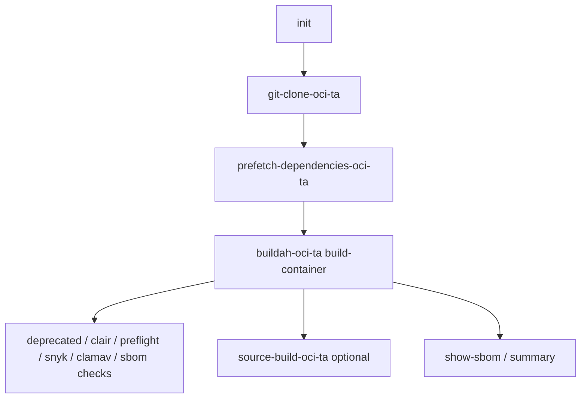

# Konflux single-arch container build — pipeline reference

Source: [single-arch-build-pipeline.yaml](https://github.com/konflux-ci/olm-operator-konflux-sample/blob/main/.tekton/single-arch-build-pipeline.yaml) (resolved at `main` by pulp-tool `.tekton/` PipelineRuns).

pulp-tool **does not** vendor this pipeline; it is fetched via `pipelineRef.resolver: git`. Re-open the upstream file when tasks or bundle digests change.

## Pipeline parameters (defaults relevant to pulp-tool)

| Param | Default | pulp-tool usage |
|-------|---------|-----------------|
| `path-context` | `.` | Repo root |
| `dockerfile` | `Dockerfile` | Root [Dockerfile](../../Dockerfile) |
| `hermetic` | `false` | Network allowed during image build (`dnf`, `pip`) |
| `prefetch-input` | `''` | No Cachi2 prefetch config in-repo |
| `skip-checks` | `false` | Post-build scans run on PR and main |
| `build-source-image` | `false` | Source image not built |
| `buildah-format` | `docker` | Docker-format image mediaType |
| `image-expires-after` | `''` | PR PipelineRun sets `5d` |

pulp-tool PipelineRuns pass: `git-url`, `revision`, `output-image`; PR also passes `image-expires-after`.

## Task flow

### Tasks (in order)

| Task | Catalog bundle | Role |
|------|----------------|------|
| `init` | `task-init:0.2` | Decide whether to build; proxy settings |
| `clone-repository` | `task-git-clone-oci-ta:0.1` | Clone `git-url` @ `revision`; workspace `git-auth` |
| `prefetch-dependencies` | `task-prefetch-dependencies-oci-ta:0.2` | Cachi2 prefetch (no-op with empty `prefetch-input`) |
| **`build-container`** | **`task-buildah-oci-ta:0.7`** | **Buildah build of `DOCKERFILE` in `CONTEXT`; push `output-image`** |
| `build-source-image` | `task-source-build-oci-ta:0.3` | Skipped (`build-source-image=false`) |
| `deprecated-base-image-check` | `task-deprecated-image-check:0.5` | Base image deprecation |
| `clair-scan` | `task-clair-scan:0.3` | Vulnerability scan |
| `ecosystem-cert-preflight-checks` | `task-ecosystem-cert-preflight-checks:0.2` | Red Hat cert preflight |
| `sast-snyk-check` | `task-sast-snyk-check-oci-ta:0.4` | SAST |
| `clamav-scan` | `task-clamav-scan:0.3` | Malware scan |
| `sbom-json-check` | `task-sbom-json-check:0.2` | SBOM validation |

**Finally:** `show-sbom`, `show-summary` (build status and image URL).

### build-container (where Dockerfile failures surface)

Key params wired by the pipeline:

- `IMAGE` → `output-image` (Quay tag from `.tekton/` PipelineRun)
- `DOCKERFILE` → `Dockerfile` (default)
- `CONTEXT` → `.` (repo root)
- `HERMETIC` → `false` (allows `dnf`/`pip` network in Dockerfile)
- `SOURCE_ARTIFACT` / `CACHI2_ARTIFACT` from clone + prefetch tasks

A failing `pip install`, missing `gcc`, or bad base image digest typically fails **`build-container`**, not GitHub Actions.

## Pipeline results

- `IMAGE_URL`, `IMAGE_DIGEST` — from `build-container`
- `CHAINS-GIT_URL`, `CHAINS-GIT_COMMIT` — supply-chain metadata

## In-repo PipelineRun differences

| | push (`pulp-tool-container-on-push`) | PR (`pulp-tool-container-on-pull-request`) |
|--|--------------------------------------|--------------------------------------------|
| PAC trigger | `push` && `main` | `pull_request` && `main` |
| `cancel-in-progress` | `false` | `true` |
| `output-image` tag | `:latest` | `:on-pr-{{revision}}` |
| `image-expires-after` | (pipeline default empty) | `5d` |
